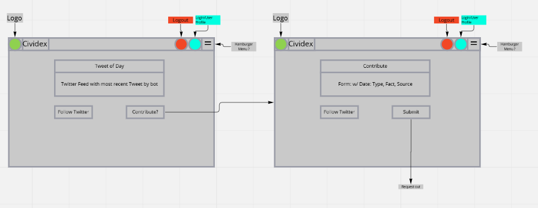
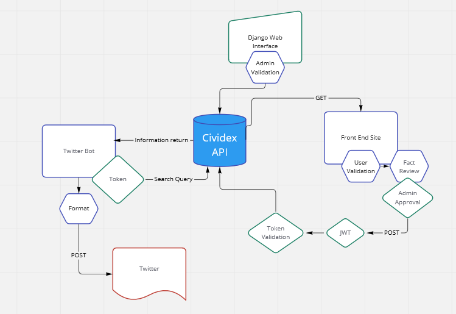

# Software Requirements
## Vision
Minimum Length: 3-5 sentences

* What is the vision of this product?
  * To educate and inform users of civil rights topics and history.

* What pain point does this project solve?
  * Helps to solve the lack of civil right education in America.

* Why should we care about your product?
  * Because everyone should understand the truth and effect of the lack of general civil rights for the fringe society.

### Scope (In/Out)
* IN - What will your product do
Describe the individual features that your product will do.
High overview of each. Only need to list 4-5

1. The bot will provide information regarding different civil rights topics in history and today.
2. The bot will provide reputable sources and facts to the user.
3. Users will be able to learn more by receiving a daily fact.
4. Each fact will be stored in the database for future retrieval.
* OUT - What will your product not do.
1. This bot will only retrieve verified sources.
2. This bot will not promote hate.

### Minimum Viable Product vs What will your MVP functionality be?
A bot that tweets out interesting civil rights facts.

### What are your stretch goals?

### Stretch
* What stretch goals are you going to aim for?
The user will receive a link to an article or articles to learn more on the daily topic.
Email verification upon sign up.
The user will be able to suggest facts for the api.

* Functional Requirements
List the functionality of your product. This will consist of tasks such as the following:

A user will be able to log in and out from the service.
A user will be able to view the fact provided.

### Data Flow
Two data flows:

Twitter bot -> Searches API -> Gets Information -> Formats information -> Connects to twitter -> Posts to twitter

Front Page -> On Load(Get Tweet/Random fact) -> User clicks contribute -> Fills in form -> data goes to another admin only page -> Admin can click submit to api -> Api will validate user, then Post to API

### Schema

### Wireframe

### Domain Model
